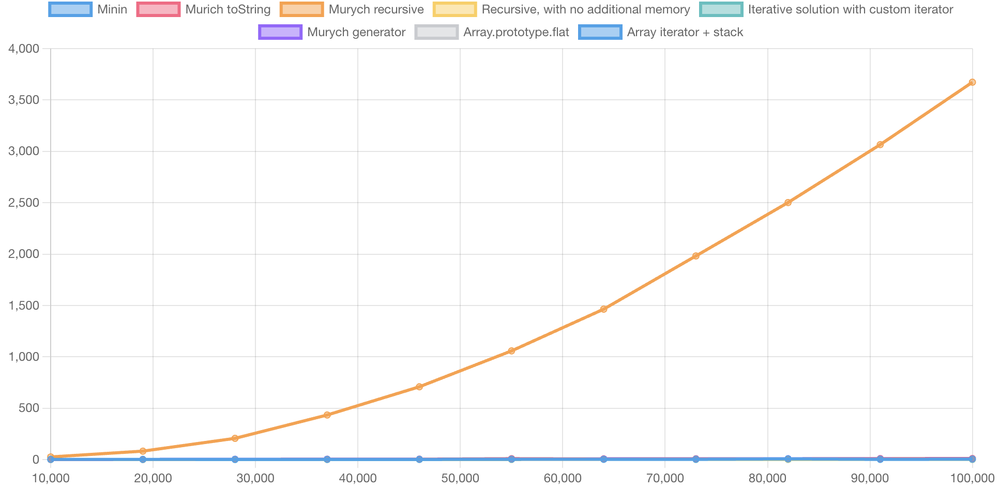
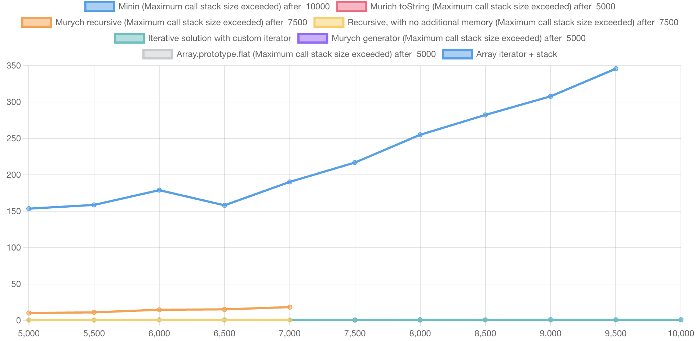

# Big O(ops.js)

Add Solutions, Add test case, add input size range, and see how your solutions compare.

[flatten implementations comparison demo](https://stepancar.github.io/Big-Oops.js/build/#code/%7B%22solutions%22%3A%5B%7B%22id%22%3A%2216972736615520.24072079035909688%22%2C%22code%22%3A%22function%20flatten(array)%20%7B%5Cn%20%20%20%20const%20res%20%3D%20%5B%5D%3B%5Cn%20%20%20%20for%20(let%20i%20%3D%200%3B%20i%20%3C%20array.length%3B%20i%2B%2B)%20%7B%5Cn%20%20%20%20%20%20%20%20if%20(Array.isArray(array%5Bi%5D))%20%7B%5Cn%20%20%20%20%20%20%20%20%20%20%20%20const%20flat%20%3D%20flatten(array%5Bi%5D)%3B%5Cn%20%20%20%20%20%20%20%20%20%20%20%20for%20(let%20j%20%3D%200%3B%20j%20%3C%20flat.length%3B%20j%2B%2B)%20%7B%5Cn%20%20%20%20%20%20%20%20%20%20%20%20%20%20%20%20res.push(flat%5Bi%5D)%3B%5Cn%20%20%20%20%20%20%20%20%20%20%20%20%7D%5Cn%20%20%20%20%20%20%20%20%7D%5Cn%20%20%20%20%20%20%20%20else%20%7B%5Cn%20%20%20%20%20%20%20%20%20%20%20%20res.push(array%5Bi%5D)%3B%5Cn%20%20%20%20%20%20%20%20%7D%5Cn%20%20%20%20%7D%5Cn%20%20%20%20return%20res%3B%5Cn%7D%5Cn%5Cnreturn%20(arr)%20%3D%3E%20%7B%5Cn%20%20return%20flatten(arr)%5Cn%7D%22%2C%22title%22%3A%22Minin%22%2C%22include%22%3Atrue%7D%2C%7B%22id%22%3A%2216972787941150.4328883126931784%22%2C%22code%22%3A%22var%20flatten%20%3D%20(%5Cn%20%20%20%20(%20theArg%20)%20%3D%3E%20%7B%5Cn%20%20%20%20%20%20%20%20return%20theArg.toString().split('%2C')%3B%5Cn%20%20%20%20%7D%5Cn)%3B%5Cn%5Cnreturn%20(arr)%20%3D%3E%20%7B%5Cn%20%20return%20flatten(arr)%5Cn%7D%22%2C%22title%22%3A%22Murich%20toString%22%2C%22include%22%3Atrue%7D%2C%7B%22id%22%3A%2216972827227620.06757049809697357%22%2C%22code%22%3A%22var%20flatten%20%3D%20(%5Cn%20%20%20%20(%20theArr%20)%20%3D%3E%20%7B%5Cn%20%20%20%20%20%20%20%20var%20theResultArray%3D%5B%5D%3B%5Cn%20%20%20%20%20%20%20%20var%20doIsArray%20%3D%20Array.isArray%3B%5Cn%5Cn%20%20%20%20%20%20%20%20for%20(var%20theValue%20of%20theArr)%20%7B%5Cn%20%20%20%20%20%20%20%20%20%20%20%20doIsArray(theValue)%5Cn%20%20%20%20%20%20%20%20%20%20%20%20%20%20%20%20%3F%20(theResultArray%20%3D%20theResultArray.concat(flatten(theValue)))%5Cn%20%20%20%20%20%20%20%20%20%20%20%20%20%20%20%20%3A%20theResultArray.push(theValue)%3B%5Cn%20%20%20%20%20%20%20%20%7D%5Cn%5Cn%20%20%20%20%20%20%20%20return%20theResultArray%3B%5Cn%20%20%20%20%7D%5Cn)%5Cn%5Cn%5Cnreturn%20(arr)%20%3D%3E%20%7B%5Cn%20%20return%20flatten(arr)%5Cn%7D%22%2C%22title%22%3A%22Murych%20recursive%22%2C%22include%22%3Atrue%7D%2C%7B%22id%22%3A%2216972868725570.13004135662203442%22%2C%22code%22%3A%22var%20flatten%20%3D%20(%5Cn%20%20%20%20(%20theArr%2C%20result)%20%3D%3E%20%7B%5Cn%20%20%20%20%20%20%20%20var%20doIsArray%20%3D%20Array.isArray%3B%5Cn%5Cn%20%20%20%20%20%20%20%20for%20(var%20theValue%20of%20theArr)%20%7B%5Cn%20%20%20%20%20%20%20%20%20%20%20%20doIsArray(theValue)%5Cn%20%20%20%20%20%20%20%20%20%20%20%20%20%20%20%20%3F%20flatten(theValue%2C%20result)%5Cn%20%20%20%20%20%20%20%20%20%20%20%20%20%20%20%20%3A%20result.push(theValue)%3B%5Cn%20%20%20%20%20%20%20%20%7D%5Cn%20%20%20%20%7D%5Cn)%5Cn%5Cn%5Cnreturn%20(arr)%20%3D%3E%20%7B%5Cn%20%20var%20result%20%3D%20%5B%5D%3B%5Cn%20%20flatten(arr%2C%20result)%5Cn%5Cn%20%20return%20result%3B%5Cn%7D%22%2C%22title%22%3A%22Recursive%2C%20with%20no%20additional%20memory%22%2C%22include%22%3Atrue%7D%2C%7B%22id%22%3A%2216972829947380.239816158729109%22%2C%22code%22%3A%22function%20flatten(array)%20%7B%5Cn%20%20%20%20var%20res%20%3D%20%5B%5D%3B%5Cn%20%20%20%20var%20isArray%20%3D%20Array.isArray%3B%5Cn%5Cn%20%20%20%20var%20top%20%3D%20new%20NestedIterator(null%2C%20array)%3B%5Cn%5Cn%20%20%20%20while%20(top)%20%7B%5Cn%20%20%20%20%20%20%20%20if%20(top.hasNext())%20%7B%5Cn%20%20%20%20%20%20%20%20%20%20%20%20var%20val%20%3D%20top.next()%3B%5Cn%20%20%20%20%20%20%20%20%20%20%20%20if%20(isArray(val))%20%7B%5Cn%20%20%20%20%20%20%20%20%20%20%20%20%20%20%20%20var%20newTop%20%3D%20new%20NestedIterator(top%2C%20val)%3B%5Cn%20%20%20%20%20%20%20%20%20%20%20%20%20%20%20%20top%20%3D%20newTop%3B%5Cn%20%20%20%20%20%20%20%20%20%20%20%20%7D%20else%20%7B%5Cn%20%20%20%20%20%20%20%20%20%20%20%20%20%20%20%20res.push(val)%3B%5Cn%20%20%20%20%20%20%20%20%20%20%20%20%7D%5Cn%20%20%20%20%20%20%20%20%7D%20else%20%7B%5Cn%20%20%20%20%20%20%20%20%20%20%20%20top%20%3D%20top.prev%3B%5Cn%20%20%20%20%20%20%20%20%7D%5Cn%20%20%20%20%7D%5Cn%5Cn%20%20%20%20return%20res%3B%5Cn%7D%5Cn%5Cnclass%20NestedIterator%20%7B%5Cn%20%20%20%20constructor(prev%2C%20list)%20%7B%5Cn%20%20%20%20%20%20%20%20this.index%20%3D%20-1%3B%5Cn%20%20%20%20%20%20%20%20this.list%20%3D%20list%3B%5Cn%20%20%20%20%20%20%20%20this.prev%20%3D%20prev%3B%5Cn%20%20%20%20%7D%5Cn%5Cn%20%20%20%20hasNext()%20%7B%5Cn%20%20%20%20%20%20%20%20return%20this.index%20%3C%20this.list.length%20-%201%3B%5Cn%20%20%20%20%7D%5Cn%5Cn%20%20%20%20next()%20%7B%5Cn%20%20%20%20%20%20%20%20const%20val%20%3D%20this.list%5B%2B%2Bthis.index%5D%3B%5Cn%20%20%20%20%20%20%20%20return%20val%3B%5Cn%20%20%20%20%7D%5Cn%7D%5Cn%5Cnreturn%20(arr)%20%3D%3E%20%7B%5Cn%20%20return%20flatten(arr)%5Cn%7D%22%2C%22title%22%3A%22Iterative%20solution%20with%20custom%20iterator%22%2C%22include%22%3Atrue%7D%2C%7B%22id%22%3A%2216972830881210.9959604380084055%22%2C%22code%22%3A%22var%20doFlat%20%3D%20(%5Cn%20%20%20%20function*%20(%20theArr%20)%20%7B%5Cn%20%20%20%20%20%20%20%20var%20theValue%3B%5Cn%20%20%20%20%20%20%20%20var%20doIsArray%20%3D%20Array.isArray%3B%5Cn%20%20%20%20%20%20%20%20for%20(theValue%20of%20theArr)%20%7B%5Cn%20%20%20%20%20%20%20%20%20%20%20%20if%20(doIsArray(theValue))%20%7B%5Cn%20%20%20%20%20%20%20%20%20%20%20%20%20%20%20%20yield*%20doFlat(theValue)%3B%5Cn%20%20%20%20%20%20%20%20%20%20%20%20%7D%20else%20%7B%5Cn%20%20%20%20%20%20%20%20%20%20%20%20%20%20%20%20yield%20theValue%3B%5Cn%20%20%20%20%20%20%20%20%20%20%20%20%7D%5Cn%20%20%20%20%20%20%20%20%7D%5Cn%20%20%20%20%7D%5Cn)%5Cn%5Cnvar%20flatten%20%3D%20(%5Cn%20%20%20%20(%20theArr%20)%20%3D%3E%20%7B%5Cn%20%20%20%20%20%20%20%20return%20%5B...doFlat(theArr)%5D%3B%5Cn%20%20%20%20%7D%5Cn)%5Cn%5Cn%5Cnreturn%20(arr)%20%3D%3E%20%7B%5Cn%20%20return%20flatten(arr)%5Cn%7D%22%2C%22title%22%3A%22Murych%20generator%22%2C%22include%22%3Atrue%7D%2C%7B%22id%22%3A%2216972836163750.6838868169588834%22%2C%22code%22%3A%22%5Cn%5Cnreturn%20(arr)%20%3D%3E%20%7B%5Cn%20%20return%20arr.flat(Infinity)%5Cn%7D%22%2C%22title%22%3A%22Array.prototype.flat%22%2C%22include%22%3Atrue%7D%2C%7B%22id%22%3A%2216972848260810.17197698256303506%22%2C%22code%22%3A%22function%20flatten(array)%20%7B%5Cn%20%20%20%20var%20res%20%3D%20%5B%5D%3B%5Cn%20%20%20%20var%20isArray%20%3D%20Array.isArray%3B%5Cn%5Cn%20%20%20%20var%20stack%20%3D%20%5Barray%5BSymbol.iterator%5D()%5D%3B%5Cn%5Cn%20%20%20%20while%20(stack.length)%20%7B%5Cn%20%20%20%20%20%20%20%20var%20top%20%3D%20stack.pop()%5Cn%20%20%20%20%20%20%20%20for%20(var%20val%20of%20top)%20%7B%5Cn%20%20%20%20%20%20%20%20%20%20%20%20if%20(isArray(val))%20%7B%5Cn%20%20%20%20%20%20%20%20%20%20%20%20%20%20%20%20stack.push(top)%3B%5Cn%20%20%20%20%20%20%20%20%20%20%20%20%20%20%20%20stack.push(val%5BSymbol.iterator%5D())%3B%5Cn%20%20%20%20%20%20%20%20%20%20%20%20%20%20%20%20break%5Cn%20%20%20%20%20%20%20%20%20%20%20%20%7D%20else%20%7B%5Cn%20%20%20%20%20%20%20%20%20%20%20%20%20%20%20%20res.push(val)%3B%5Cn%20%20%20%20%20%20%20%20%20%20%20%20%7D%5Cn%20%20%20%20%20%20%20%20%7D%5Cn%20%20%20%20%7D%5Cn%5Cn%20%20%20%20return%20res%3B%5Cn%7D%5Cn%5Cnreturn%20(arr)%20%3D%3E%20%7B%5Cn%20%20return%20flatten(arr)%5Cn%7D%22%2C%22title%22%3A%22Array%20iterator%20%2B%20stack%22%2C%22include%22%3Atrue%7D%5D%2C%22testCases%22%3A%5B%7B%22id%22%3A%2216972736647920.06759134529400956%22%2C%22code%22%3A%22%2F%2F%20pass%20test%20data%20into%20solution%5Cn%5Cnreturn%20(solution%2C%20%7B%20arr%20%7D)%20%3D%3E%20solution(arr)%22%2C%22generateDataCode%22%3A%22%2F**%5Cn*%20%5B0%2C%5B1%2C%5B2%2C%5B3%2C...n%20times%3B%5D%5D%5D%5D%5Cn*%2F%5Cnfunction%20generateDeepArray(depth)%20%7B%5Cn%20%20%20%20let%20res%20%3D%20%5B%5D%3B%5Cn%20%20%20%20var%20root%20%3D%20res%3B%5Cn%20%20%20%20for%20(let%20i%20%3D%200%3B%20i%20%3C%20depth%3B%20i%2B%2B)%20%7B%5Cn%20%20%20%20%20%20%20%20res.push(i)%3B%5Cn%20%20%20%20%20%20%20%20var%20nextLevel%20%3D%20%5B%5D%3B%5Cn%20%20%20%20%20%20%20%20res.push(nextLevel)%3B%5Cn%20%20%20%20%20%20%20%20res%20%3D%20nextLevel%3B%5Cn%20%20%20%20%7D%5Cn%20%20%20%20return%20root%3B%5Cn%7D%5Cn%5Cnreturn%20(%7Bn%7D)%20%3D%3E%20(%7B%20arr%3A%20generateDeepArray(n)%20%7D)%22%2C%22title%22%3A%22Deep%20Array%2C%20should%20highlight%20problems%20with%20Max%20call%20stack%20size%22%2C%22minInputSize%22%3A5000%2C%22maxInputSize%22%3A10000%2C%22stepsCount%22%3A10%7D%2C%7B%22id%22%3A%2216978728759860.5117488151812426%22%2C%22code%22%3A%22%2F%2F%20pass%20test%20data%20into%20solution%5Cn%5Cnreturn%20(solution%2C%20%7B%20arr%20%7D)%20%3D%3E%20solution(arr)%22%2C%22generateDataCode%22%3A%22%2F**%5Cn*%20%5B0%2C%5B1%5D%2C2%2C%5B3%5D%2C4%20.....n%5D%5Cn*%2F%5Cnfunction%20generate2LvelsArray(n)%20%7B%5Cn%20%20const%20res%20%3D%20%5B%5D%5Cn%5Cn%20%20for%20(let%20i%20%3D%200%3B%20i%3C%20n%3B%20i%2B%2B)%20%7B%5Cn%20%20%20%20%20if%20(i%20%25%202%20%3D%3D%3D%200)%20%7B%5Cn%20%20%20%20%20%20%20%20res.push(i)%5Cn%20%20%20%20%20%7D%20else%20%7B%5Cn%20%20%20%20%20%20%20%20res.push(%5Bi%5D)%5Cn%20%20%20%20%20%7D%5Cn%20%20%7D%5Cn%20%20%5Cn%20%20return%20res%3B%5Cn%7D%5Cn%5Cnreturn%20(%7Bn%7D)%20%3D%3E%20(%7B%20arr%3A%20generate2LvelsArray(n)%20%7D)%22%2C%22title%22%3A%222%20levels%20array%20%22%2C%22minInputSize%22%3A1000%2C%22maxInputSize%22%3A10000%2C%22stepsCount%22%3A10%7D%5D%7D)

In case solution failed to execute, you can see error message in report

